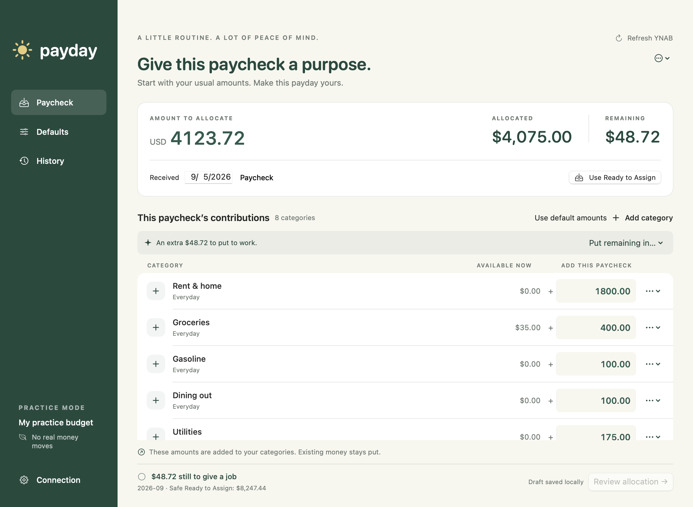

# Payday

A small native Mac app for giving each paycheck a job in YNAB.

Enter what you received, adjust your usual contributions, and confirm. Payday adds those contributions to your categories, preserving the money already there. It runs only while open, with no server, subscription, telemetry, or remote infrastructure.



## Run it

Requires macOS 15 or later and a Swift 6 toolchain (Xcode or Apple Command Line Tools) to build. No third-party packages are required.

```sh
bash scripts/package.sh
open dist/Payday.app
```

You can drag `dist/Payday.app` into Applications and open it normally thereafter. Close the last window to quit. The generated app is signed locally; this is not a notarized public release.

Try an entirely separate sample budget first:

```sh
open dist/Payday.app --args --demo
```

Quit an already-running Payday before switching modes. Practice mode never reads the real token or contacts YNAB. Its defaults, history, and simulated budget persist separately.

For development:

```sh
swift run Payday --demo
swift test
```

## Your first payday

1. In YNAB’s [Developer Settings](https://app.ynab.com/settings/developer), generate a Personal Access Token for your own account. Paste it into Payday’s Connection screen and select a budget. The token is stored in macOS Keychain.
2. In **Defaults**, click **Add category**, choose as many categories as you need, then click **Done**. Enter the normal contribution amounts. Drag the row handles to reorder categories, or use the row menu’s **Move up/down** actions.
3. Open **Paycheck**: your default categories, order, and amounts appear automatically. Enter the actual paycheck amount, or click **Use Ready to Assign** to fetch all currently available money across your budget, regardless of which accounts received it. This also works for unexpected income. The amount includes the existing future-month safety check.
4. Edit contributions or use **Put remaining in…** to assign the exact difference to a category. Add one-off categories whenever needed. Money fields place the decimal automatically: type `1` for `0.01`, `10` for `0.10`, and `100` for `1.00`. Clicking selects the current amount for replacement; Backspace shifts digits back. Paste a fully formatted amount such as `4123.72` without grouping separators. Other currency precisions continue to follow the budget’s settings.
5. Review every contribution, the explicit budget month, and available funds. Confirm that the paycheck is already in Ready to Assign and has not previously been allocated, then apply.

Changes in the Paycheck screen are temporary. Default changes update unadjusted rows in the current draft automatically, while paycheck-specific adjustments and omissions are preserved. New defaults are included immediately; the saved order carries through the paycheck, review, and new history entries. One-off rows follow the default rows. Existing history retains its original recorded order and amounts.

The visible **Use default amounts** button restores the complete default allocation without clearing the amount to allocate or its reference. A row’s menu can make its amount the new default, or the paycheck menu can explicitly replace the whole default allocation.

**Use Ready to Assign** only fills in the amount; you must still balance, review, and confirm. Each new RTA allocation gets a dated reference, with a numbered suffix for additional allocations that day. Reusing the button within a draft keeps the same identity. It does not create or duplicate deposits, and it cannot identify assignments you made outside Payday. Linking one specific deposit remains available in the paycheck’s menu under **Link a YNAB deposit**.

Shortcuts: ⌘1 Paycheck, ⌘2 Defaults, ⌘3 History, ⌘R refresh. Draft amounts are saved locally as valid values are entered. Invalid unfinished text is highlighted and blocks review; reopening restores the last valid saved values.

## What “add $400” means

If Groceries has $35 available and you contribute $400, its available amount becomes $435, assuming no concurrent spending. If Car Repair has $2,000, another $75 makes it $2,075.

YNAB’s category API accepts an absolute monthly **Assigned** amount. Payday therefore calculates `new assigned = existing assigned + contribution`. It never sets a category’s available balance, creates income, moves account money, or edits transactions or targets. All arithmetic uses integer milliunits, including zero-, two-, and three-decimal currencies.

The first version deliberately assigns to the current calendar month on your Mac, pinned to an explicit `YYYY-MM-01`. Old drafts are blocked after a month rollover; start a fresh draft. Historical/future-month allocation is outside the initial workflow.

Hidden, deleted, and internal categories/groups are excluded conservatively. Credit-card payment category eligibility has not been verified against a live budget; YNAB's public documentation does not establish their internal flags. A category omitted by this guard must be handled in YNAB.

## Safety and interruptions

Payday requires exact allocation and enough Ready to Assign. It conservatively checks the minimum Ready to Assign across the target and later budget months, so assignments made ahead cannot silently consume this paycheck’s funds.

YNAB has no documented atomic multi-category assignment, conditional category write, or category idempotency key. Payday cannot eliminate races with another YNAB client. Keep YNAB unchanged on other devices while applying. The [API research](docs/ynab-api-research.md) records the official sources and limitations.

Before any write, Payday commits an immutable paycheck claim and its category intents to SQLite. It records a step as in flight before sending it, writes categories sequentially, checks live assignments and funds between steps, and verifies every final assignment before reporting completion. A process lock prevents two copies from writing concurrently. The API request budget is checked before starting when YNAB supplies rate-limit metadata.

If something fails, open **History**:

- **Confirmed**: YNAB acknowledged the requested assignment. A completed operation also passed a final read of every target.
- **Uncertain / In flight**: a request may have reached YNAB. Never assume it failed because the connection did.
- **Not attempted**: Payday never sent this contribution.

An interrupted operation blocks new writes. Use **Read current YNAB assignments** for evidence, then inspect Assigned amounts and recent money moves in YNAB. Complete or correct the paycheck there. If a request may still be pending, wait and verify again. Record your reconciliation note in Payday when finished. This sends no money and preserves the original uncertainty in the audit record. Payday never automatically retries, rolls back, or resumes a partial allocation.

Duplicate protection reserves the operation UUID, budget/date/reference, and optional deposit ID and its matched/import aliases. It survives refresh and relaunch. It cannot identify allocations made outside Payday, recognize a manual paycheck deliberately entered under a new identity, or preserve protection after history is deleted or restored from an older backup. A same-date/same-amount warning supplements identity checks.

## Local data and security

- Real data: `~/Library/Application Support/Payday/`
- Practice data: `~/Library/Application Support/Payday Practice/`
- Token: Keychain service `app.payday.ynab`; never in the database or exported history.
- Database: transactional SQLite with full synchronous commits; enclosing directory mode `0700`, database mode `0600`.
- Network: direct HTTPS to `api.ynab.com`, ephemeral session, no cookies/disk cache, no token or response logging, redirects refused, no application-level write retries.

History and defaults are not encrypted by the app. Use FileVault and protect your Mac account and backups. History exports contain financial information. Disconnect deletes the token but retains local history. To revoke it at YNAB, use Developer Settings.

Back up the data folder while Payday is closed. Do not restore an older database and then reallocate later paychecks: restored history cannot know what happened after the backup. Corrupt or unsupported data fails closed; the app does not silently reset its journal. See [SECURITY.md](SECURITY.md).

## Project structure

```text
Sources/Payday/          Native SwiftUI screens, app state, Keychain
Sources/PaydayCore/      Money, YNAB client, SQLite journal, allocation engine
Sources/CSQLite/         System SQLite module
Tests/PaydayCoreTests/   Financial invariants, recovery, HTTP contract tests
packaging/              macOS bundle metadata
scripts/                Reproducible app packaging and code-drawn icon
docs/                   API evidence, design, verification notes
```

The core is independent of SwiftUI and depends on a small `BudgetAPI` interface. Tests use a simulated server and intercepted HTTP requests; they do not access credentials or real budgets. CI runs tests and builds the app on macOS. See [architecture](docs/architecture.md) and [verification](docs/verification.md).

For a distributable binary, set `PAYDAY_SIGN_IDENTITY` to your Developer ID identity when packaging, then notarize and staple through Apple’s tools. The default build targets the Mac’s native architecture. Build and validate separate architectures or a universal binary before distributing to both Intel and Apple Silicon users. Publishing and signing infrastructure are not part of this local deliverable.

This source-build workflow uses each owner’s own Personal Access Token. A broadly distributed integration that obtains delegated access for other users must implement YNAB’s OAuth requirements before release. No shared token or client secret belongs in this repository.

Independent software, not affiliated with or endorsed by YNAB. MIT licensed.

## Contributing and project policies

Contributions are welcome. Start with [CONTRIBUTING.md](CONTRIBUTING.md) and follow the [Code of Conduct](CODE_OF_CONDUCT.md). Please use synthetic financial data in all reports and tests. Security issues belong in the private channel described in [SECURITY.md](SECURITY.md), not a public issue.

Payday's data practices are documented in [PRIVACY.md](PRIVACY.md). The current [open-source readiness audit](docs/open-source-readiness-audit.md), [privacy audit](docs/privacy-audit.md), and [security audit](docs/security-audit.md) record the checks performed and the remaining conditions for distributing signed binaries.
